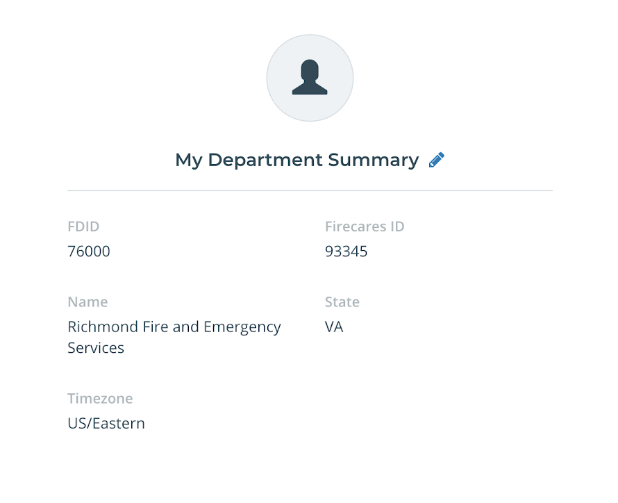
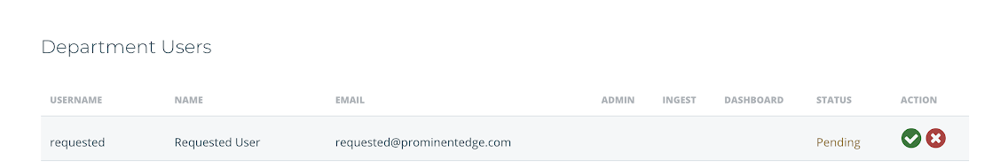

# Admin Guide

## Overview

As an administrator, you have extra privileges to manage your departments users and and other administrative features.

### Data Access

After a user signs up and requests access to your departments data, you can approve or disapprove access.

1.  Navigate to your Department Admin screen by clicking the pencil icon in My Department Summary

  

2.  Approve/disapprove access by clicking the appropriate icon in the action column.

  
