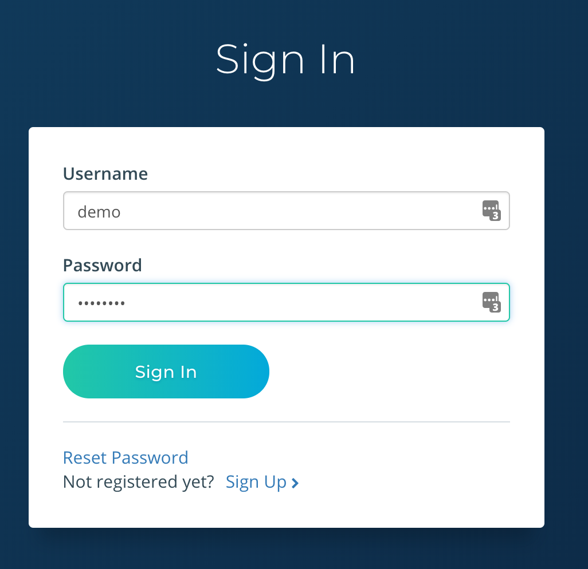

# On-Premise Installation

## Overview

The on-premise solution is best suited if you prefer managing all aspects of data, security, and extensions of the platform yourself. The on-premise solution is also useful for experimenting with customizations, developing your own extensions, and utilizing in constrained testing environments. As things can get a bit technical, we only recommend using the on-premise method if you have skilled IT personnel available to setup and support the platform.


## Prerequisites

The on-premise solution is delivered in a [*.box*](https://www.vagrantup.com/docs/boxes/format.html) format.  
Utilizing *.box* and Vagrant provisioning, the on-premise solution can run on Windows, Linux, and OS X operating systems.

The following prerequisites are needed

* [VirtualBox](https://www.virtualbox.org/wiki/Downloads)
* [Vagrant](https://www.vagrantup.com/downloads.html)
* [Wget or Curl](https://www.vagrantup.com/downloads.html)


## Quick Start

### Initialize Environment

Lets setup Vagrant and download the latest configuration.
Run the following in your terminal:
```
$ mkdir stat-engine
$ cd stat-engine
$ wget https://s3/...
```

### Provisioning

It is time to boot up StatEngine.
Run the following from your terminal:
```
$ vagrant up
```
This command will finish and you will have a virtual machine running StatEngine. You will not actually see anything though, since Vagrant runs the virtual machine without a UI.

### Start Exploring

1.  Open your favorite browser (we recommend [Chrome](https://www.google.com/chrome/)) and navigate to [http://localhost:8080](http://localhost:8080).  You will see the landing page.  

  

2.  Click the ```Sign In``` button on right side of the top navigation bar.  Login to the application using the following credentials

  > username: ```demo```

  > password: ```password```

  

3.  Click the ```Dashboard``` button to access your the data.  That's it. Simple as that!

  > Screenshot to be supplied.

### Next Steps

For more information on how to use StatEngine, check out our [User Guide] for more info on how to use the dashboard or checkout some of your [training videos].  

If you want to continue using the on-premise solution to connect and ingesting your own data, follow our advanced guides.


## Advanced

### Connecting your own data

> To be supplied.

#### Overview

> To be supplied.

#### Developing your own Siamese plugin

> To be supplied.

#### Adding a Siamese plugin

> To be supplied.

### Ingest

> To be supplied.

#### Spade

> To be supplied.

#### Developing your own transporter

> To be supplied.
