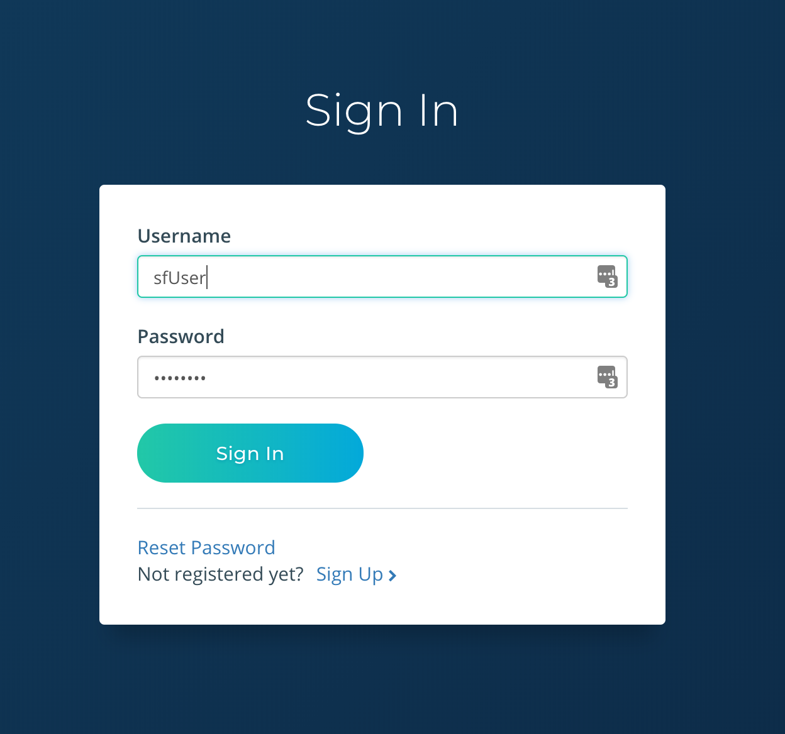

# On-Premise Installation

## Overview

The on-premise solution is best suited if you prefer managing all aspects of data, security, and extensions of the platform yourself. The on-premise solution is also useful for experimenting with customizations, developing your own extensions, and utilizing in constrained testing environments. As things can get a bit technical, we only recommend using the on-premise method if you have skilled IT personnel available to setup and support the platform.


## Prerequisites

The on-premise solution is delivered in a [*.box*](https://www.vagrantup.com/docs/boxes/format.html) format.  
Utilizing *.box* and Vagrant provisioning, the on-premise solution can run on Windows, Linux, and OS X operating systems.

The following prerequisites are needed

* [VirtualBox](https://www.virtualbox.org/wiki/Downloads)
* [Vagrant](https://www.vagrantup.com/downloads.html)
* [Wget or Curl](https://www.vagrantup.com/downloads.html)

## Quick Start

### Download Latest Release

Lets download the latest release and add to vagrant.
Run the following in your terminal:
```
$ mkdir stat-engine
$ cd stat-engine
$ wget https://s3.amazonaws.com/statengine-public-artifacts/statengine-latest.box
$ vagrant box add statengine-appliance-latest.box --name statengine/statengine-appliance
```

### Provisioning

It is time to boot up StatEngine.
Run the following from your terminal:
```
$ vagrant init statengine/statengine-appliance
```

With your favorite text editor, add this line to generated ```Vagrantfile``` within the configuration block
```
config.vm.network "forwarded_port", guest: 8080, host: 8080
```

Now run
```
$ vagrant up
```
This command will finish and you will have a virtual machine running StatEngine. You will not actually see anything though, since Vagrant runs the virtual machine without a UI.  

### Start Exploring

1.  Open your favorite browser (we recommend [Chrome](https://www.google.com/chrome/)) and navigate to [http://localhost:8080](http://localhost:8080).  You will see the landing page.  

  

2.  Click the ```Sign In``` button on right side of the top navigation bar.  Login to the application using the following credentials

  > username: ```sfUser```

  > password: ```password```

  

3.  Click the ```Dashboard``` button to access your the data.  That's it. Simple as that!

  


### Next Steps

For more information on how to use StatEngine, check out the [User Guide](userGuide.md) for more info on how to use the dashboard or checkout some of the other [resources](resources).  

If you want to continue using the on-premise solution to connect and ingesting your own data, follow our advanced guides.


## Advanced

Great, you love StatEngine and you want to start consuming on your data!  This section is intended for developers who to start writing their own normalizers and
ingesting into an On-premise instance of StatEngine.  

## Tutorial - San Francisco Fire Department

For this tutorial, we are going to write our own normalizer to ingest San Francisco Fire Department publicaly available at [DataSF](https://datasf.org/).  The dataset includes fire units responses to calls. Each record includes the call number, incident number, address, unit identifier, call type, and disposition. All relevant time intervals are also included. Because this dataset is based on responses, and since most calls involved multiple units, there are multiple records for each call number. Addresses are associated with a block number, intersection or call box, not a specific address.  The dataset also includes API, which will be useful for polling for recent data.

### Part 1:  Developing your own Siamese plugin

#### Introduction
A *siamese* project is responsible for transforming *raw* source data into a normalized StatEngine data structures as defined by our schemas.  
In our case, the *raw* source data is the data provided by the [DataSF Fire Department Calls for Service Dataset](https://data.sfgov.org/Public-Safety/Fire-Department-Calls-for-Service/nuek-vuh3), but can come from any RMS or CAD export and in a variety of formats such as XML, JSON, CSV, or flat files.  

Raw fire incident data will vary from source to source, but generally we can expect the data to include geographic locations, timestamp, and other attributes such as incident number, priority level, and information on apparatus responding to the call.

A sample *raw* source file from San Francisco:
```
{
  "address": "500 Block of WALLER ST",
  "als_unit": false,
  "available_dttm": "2017-06-23T20:35:46.000",
  "battalion": "B05",
  "box": "3635",
  "call_date": "2017-06-23T00:00:00.000",
  "call_final_disposition": "Fire",
  "call_number": "171743725",
  "call_type": "Alarms",
  "call_type_group": "Alarm",
  "city": "San Francisco",
  "dispatch_dttm": "2017-06-23T20:34:06.000",
  "entry_dttm": "2017-06-23T20:33:40.000",
  "final_priority": "3",
  "fire_prevention_district": "5",
  "incident_number": "17073664",
  "location": {
    "type": "Point",
    "coordinates": [-122.432321754736, 37.770966902634]
  },
  "neighborhoods_analysis_boundaries": "Haight Ashbury",
  "number_of_alarms": "1",
  "original_priority": "3",
  "priority": "3",
  "received_dttm": "2017-06-23T20:30:09.000",
  "rowid": "171743725-B05",
  "station_area": "06",
  "supervisor_district": "5",
  "unit_id": "B05",
  "unit_sequence_in_call_dispatch": "3",
  "unit_type": "CHIEF",
  "watch_date": "2017-06-23T00:00:00.000",
  "zipcode_of_incident": "94117"
}
```
The resulting normalized message:
```
{
  "address": {
    "address_id": "",
    "address_line1": "500 Block of WALLER ST",
    "city": "San Francisco",
    "postal_code": "94117",
    "response_zone": "3635",
    "state": "CA",
    "longitude": -122.432321754736,
    "latitude": 37.770966902634,
    "battalion": "B05",
    "first_due": "06",
    "neighborhood": "Haight Ashbury",
    "geohash": "9q8yvgzxb4s1"
  },
  "description": {
    "event_opened": "2017-06-23T20:33:40-07:00",
    "event_closed": "2017-06-23T20:35:46-07:00",
    "type": "Alarms",
    "subtype": "Alarm",
    "event_id": "171743725",
    "incident_number": "17073664",
    "psap_answer_time": "2017-06-23T20:30:09-07:00",
    "category": "FIRE",
    "hour_of_day": 20,
    "day_of_week": "Friday",
    "shift": "C",
    "priority": "3",
    "alarms": 1,
    "extended_data": {
      "psap_answer_time_to_event_creation": 211,
      "event_duration": 126
    }
  },
  "apparatus": [
    {
      "unit_id": "B05",
      "unit_type": "Chief Officer",
      "unit_status": {
        "dispatched": {
          "timestamp": "2017-06-23T20:34:06-07:00"
        },
        "available": {
          "timestamp": "2017-06-23T20:35:46-07:00"
        }
      },
      "shift": "C",
      "extended_data": {
        "event_duration": 100
      }
    }
  ],
  "fire_department": {
    "fd_id": "38005",
    "firecares_id": "94264",
    "name": "San Francisco Fire Department",
    "state": "CA",
    "timezone": "US/Pacific"
  },
  "version": "0.0.1"
}
```

You will notice the same information appears in both structures, but mapped to different fields.  For example, incident_number, ***17073664*** is mapped to *description.incident_number* in the normalized incident.

You may also notice mapped, but also transformed fields.  For example, the unit_type ***CHIEF*** not only appears under *apparatus[index].unit_type*, but is also *transformed* to ***Chief Officer***.

Siamese projects can do any number for mappings, transformations, or other modifications to *raw* source data.

#### Ingest Semantics

When designing a siamese project, please keep the following semantics in mind:

* **Out-of-order processing**: All attempts should be made to send data in order.  However, if the server can detect the event time (either by message timestamp or file naming conventions) the server-side processing can handle out-of-order arrival.

* **At-least once processing**: The server-side processing gurantees a message will be processed at-least once.  Therefore, resending the same message should not impact the final normalized message.

* **Upsert processing**:  Messages concerning the same incident are merged and upserted. This enables desirable message semantics such as the ability to send partial messages that only contain a single apparatus.  Nil (```null``` or ```undefined```) fields are filtered out prior to merging.

#### Developing your own Siamese project

##### Prerequisites

The following prerequisites are needed

* [node.js](https://nodejs.org/en/)
* [npm](https://www.npmjs.com/get-npm)
* FIRECARES Information regarding your department

  1.  Visit [FIRECARES](https://firecares.org)
  2.  Search for your department
  
  3.  Navigate to appropriate search result.
  

  4.  Record the following information:

    a) FDID

    b) Name

    c) State

    d) FIRECARES ID (this is the number that appears in the URL. e.g. ***94264***)

##### Generating Stubs

1. Install Yeoman

  ```
  npm install -g yo
  ```

2. Install Siamese Generator
  ```
  npm install -g generator-siamese
  ```

3. Generate new Siamese project
  ```
  yo siamese
  ```

4. Answer questions accordingly:

  

5. Develop!

  As a example, lets look at how we can normalize the address via ```normalizeAddress()```:
  ```
  normalizeAddress() {
    const payload = this.payload;

    const address = {
      address_id: '',
      address_line1: payload.address,
      city: payload.city,
      postal_code: payload.zipcode_of_incident,
      response_zone: payload.box,
      state: 'CA',
      longitude: parseFloat(payload.location.coordinates[0]),
      latitude: parseFloat(payload.location.coordinates[1]),
      battalion: payload.battalion,
      first_due: payload.station_area,
      neighborhood: payload.neighborhoods_analysis_boundaries,
    };

    address.geohash = IncidentNormalizer.latLongToGeohash(address.longitude, address.latitude);

    return address;
  }
  ```
  This function implements basic mappings from raw source to the expected locations in the schema.  
  This example is fairly straight forward, but the normalization logic can be as advanced as you like.  
  At this point on your on!  We suggest diving into the
  demo [source](https://github.com/StatEngine/siamese-san-francisco-demo) to see some more advanced examples.


### Part 2:  Adding a Siamese project to Stat Engine

After developing a siamese project, lets now add it to the ingest pipeline.
On the machine running the appliance:

1.  ```vagrant ssh```
2.  ```cd plugins```
3.  ```npm install siamese-san-francisco-demo```
4.  ```docker restart stat-engine-ingest-worker```

### Part 3:  Sending data

We suggest using Spade to send the raw data to StatEngine.
Head over [here](https://statengine.io/spade) to get started sending the raw data.   
