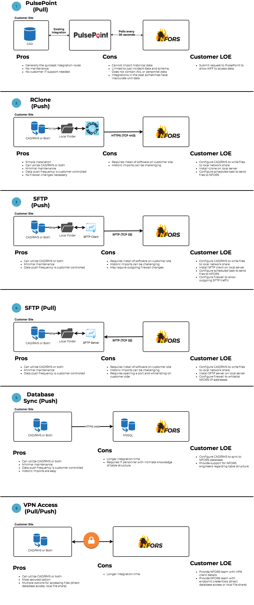

## Overview

The onboarding process can take a few hours to several weeks depending on the complexity, security, and resources available to support the onboarding process.  We're here to support you along the way, so please reach out to us if you need support!

### 1. Connect Your Data
StatEngine integrates with common fire department data sources including data warehouses, Computer Aided Dispatch (CAD) systems and Records Management Systems (RMS). Multiple approaches, listed below, can be used to securely send data to StatEngine. Your department should review the various approaches and once the desired integration approach contact us to get setup.

#### Choosing a data source

The first question to consider is - what is your preferred data source?

Please consider the fields that StatEngine analyzes:

***Required***

- Incident opened time
- Incident closed time
- Location of incident (Lat/Lon)
- Incident type and/or subtype
- For each apparatus on the call  
  - Dispatch time
  - Enroute time
  - Arrival time
  - Cleared or available time

***Optional, but highly desired***

- PSAP answer time
- Number of alarms (1 Alarm fire, 2 Alarm Fire, etc)
- Address Information (Apt Num, Street Address, City, State, Common Name, etc)
- First due station
- Response zone or firebox
- Dispatch comments or narrative
- Priority of call
- Flag indicating if the call is mutual aid
- First due unit
- For each apparatus on the call  
  - Distance from incident at dispatch time
  - Patient contact time (if applicable)
  - Transport departure time (if applicable)
  - Transport arrival time (if applicable)
  - Transport destination
  - Response priority
  - Personnel/employee ids of those on the apparatus

***Other optional time fields***
- Command established time
- Air monitoring complete time
- LOI search complete time
- Loss stopped time
- Primary search complete time
- Secondary search complete time
- Rehab established  time
- RIC established time
- Effective response force arrival time

Please keep in mind, we can supplement some data if the field is not natively available in the datasource.  For example, often times with CAD integrations - we will determine response zone based on an GIS service because the CAD is not response zone aware.  

The Pros and Cons are summarized below:

#### CAD

##### Pros
- Generally the easiest and quickest to integrate with
- Real-time analysis and daily workflows

##### Cons
- Personnel information generally not available.  Employees cannot track exposures as easily
- Incident type is based on the dispatch time and not the final disposition
- Optional time fields, such as water on fire, command established, etc not available

#### RMS

##### Pros
- Personnel information might be available.  Employees can easily track exposures by employee id

##### Cons
- Analysis might not be available on a realtime basis
- RMS interfaces are generally more difficult to export and interface with

#### Choosing an integration method

The second question you should consider is - what is the integration method?  

Figure 1 describes our current integration methods.
This file can also be downloaded [here](https://s3.amazonaws.com/statengine-public-assets/NFORS_Integrations.pdf).

  

### 2. Verify Your Data
Once StatEngine starts receiving data, we will work with you to identify missing or erroneous data. Often times we'll need details on missing apparatus types, battalion and district mappings to enrich your data to the fullest extent.

### 3. Access Your Data
After data verification, we will set you up with a customized [Dashboard](userGuide?id=Dashboard) so you can start exploring your data.

### 4. Explore Your Data Even More
StatEngine has even more ways to add and enrich your data via the [Marketplace](userGuide?id=Marketplace). Explore plugins and apps like adding weather, traffic, or directly tweeting stats to Twitter.
