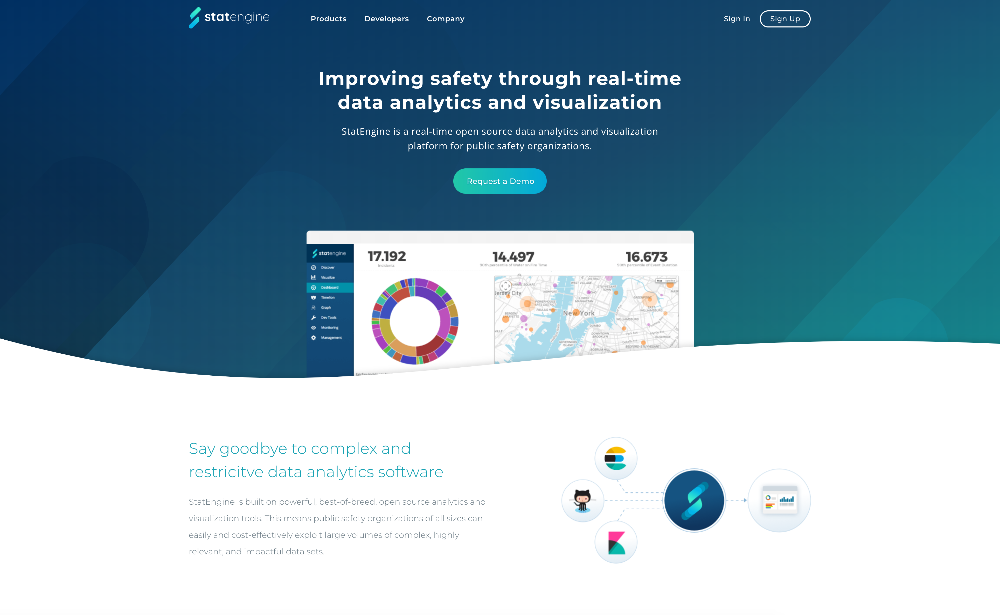
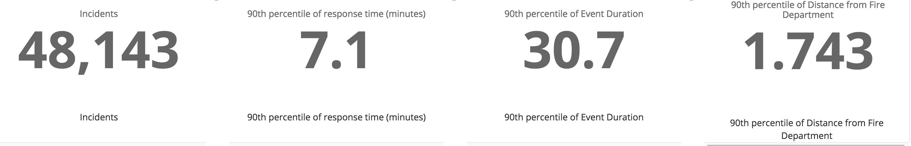
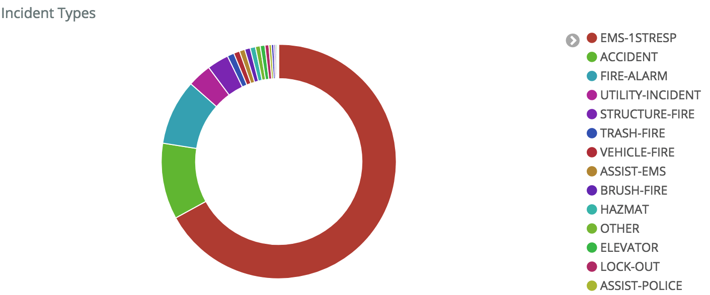
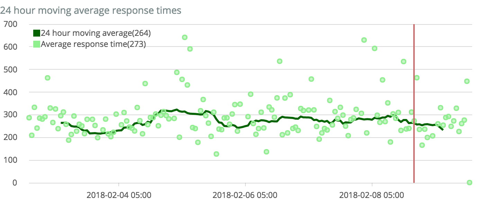
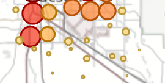

# User Guide

## Overview

Now that your department is onboarded, lets get started using the platform.

### Signup

1.  Open your favorite browser (we recommend [Chrome](https://www.google.com/chrome/)) and navigate to [http://localhost:8080](http://localhost:8080).  You will see the landing page.  

  

2.  Click the ```Sign Up``` button on right side of the top navigation bar. Fill out the details, specifying the department you belong to.  

  

3.  At this point, your local administrator will receive notification of you pending access.  In the meantime, check out our training videos and other        
  [resources](resources.md).

### Dashboard

1.  After your local administrator approves data access, log back in using the credentials created earlier.

2.  Access your dashboard via the dashboard button.

3.  Explore some of the visualizations.

These are just a few visualizations that come built-in to your dashboard, but you have the ability to create new and custom ones. The possibilities are endless!

##### Basic Metrics

Get quick incident metrics on turnout time, response time, and more for yesterday, last week, last year, or even a custom time period.

  

##### Complex Graphs

Plot which units respond to the most calls, how each unit is utilized across call types, or both.

  

##### Advanced Time Series

Perform advanced time series analysis such as averaging unit response time or visualizing which hour of the day is most active.

  

##### Geospatial Data

Plot all incidents on a map or see where your most active and high-demand areas are.

  


### Marketplace

The marketplace offers additional extensions to extend and dive deeper into analysis of your data.  Add data enrichments such as weather, traffic, or population density to your incidents.  Tweet active incidents or yesterday's stats directly to Twitter.
